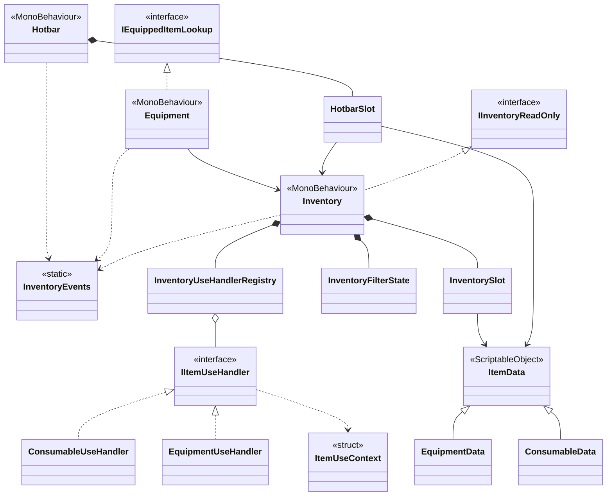
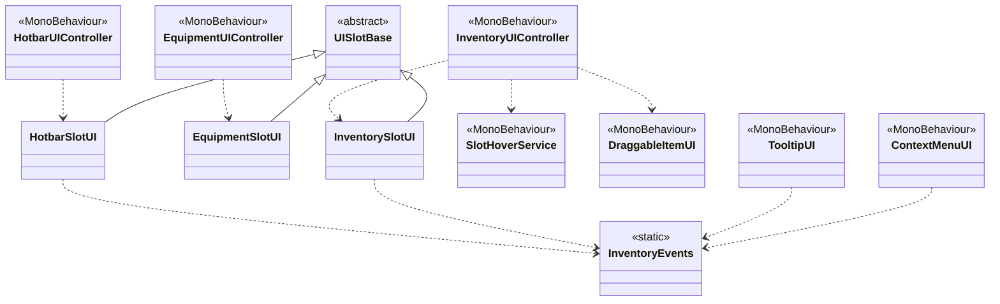
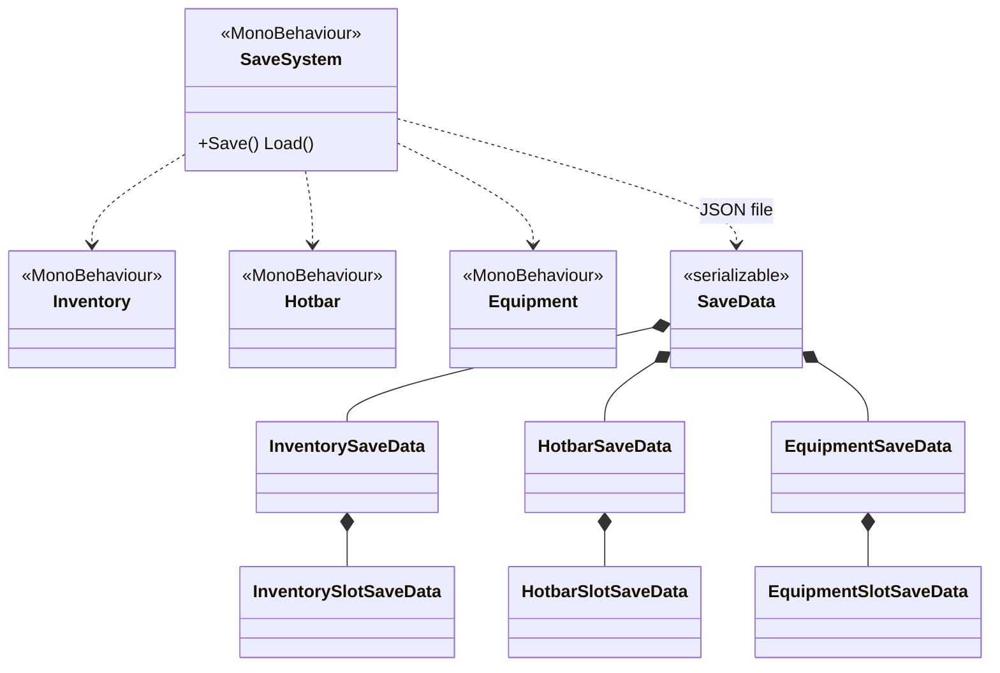

# Reusable Inventory System

Reusable inventory module with a small 3D demo:

- Inventory
- Equipment
- Hotbar
- Drag-and-drop UI
- Tooltips
- Context menu
- Filters/sort
- JSON save/load

## Requirements

- Unity 6 (project saved with `6000.3.9f1`)

## How to run the demo scene

1. Open `Assets/Scenes/Demo.unity` and Press Play.
2. Controls:
   - Character movement: W / A / S / D or arrow keys
   - Jump: Space
   - Rotate camera: Right-click
   - Zoom in/out: Mouse wheel
   - Pick up items: E
   - Toggle inventory: I
   - Split stack: X
   - Open context menu: Middle-click

## How to set up a new scene

Wire the following components in the Inspector:

| Role | Components |
|------|------------|
| Items | `ItemDatabase` — assign `ItemData` / `EquipmentData` / `ConsumableData` assets. |
| Gameplay | `Inventory`, `Equipment`, `Hotbar`. |
| UI | `InventoryUIController`, `EquipmentUIController`, `HotbarUIController` as needed; `ContextMenuUI`, `TooltipUI`, drag icon, slot prefabs. |
| Wiring | `ItemSystemConfigurator` — drag references above, assign a `ItemSystemConfiguration` asset. |
| Save | `SaveSystem` — references to `Inventory`, `Equipment`, `Hotbar`, and an `IItemDatabase` provider. |

## Code layout

- `Assets/Scripts/InventorySystem/Runtime/` — inventory, equipment, hotbar, UI, save DTOs, events.  
- `Assets/Scripts/Demo/` — player, camera, spawners, demo-only helpers.

## Class Diagrams
- Core Domain

- UI

- Save / Load

